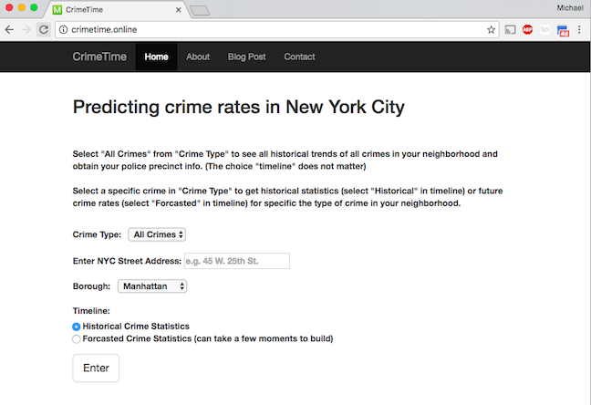
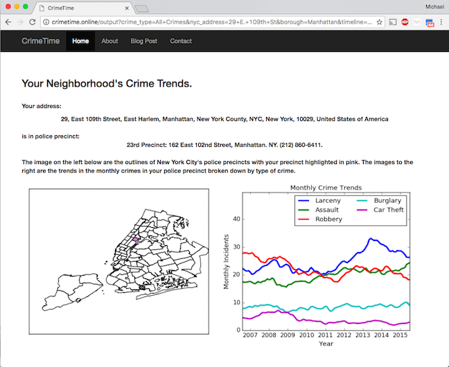
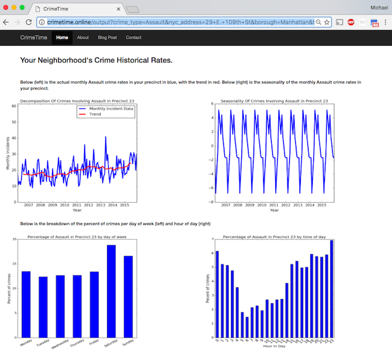

.. backend documentation master file, created by
   sphinx-quickstart on Thu Feb  2 16:41:54 2017.
   You can adapt this file completely to your liking, but it should at least
   contain the root `toctree` directive.

Welcome to CrimeTime's documentation page!
==========================================

*To see the web application in action visit:* `www.crimetime.online <www.crimetime.online>`_

Introduction
------------

This web application was part of a 3 week project at `Insight Data Science <http://insightdatascience.com/>`_.  
Users are prompted to enter 
an address from the input page seen below.
	

And they get back a report on the historical trends of crimes in their neighborhood

	
.. centered::

Users can look at the historical data of specific crimes in their neighborhood and get 
more specific on trends, seasonality, as well as which days and time most crimes happen like the results below:

	
.. centered::

Users can also choose to forecast specific crime rates in their neighborhood into the future.

Documentation
-------------
This code was written in `Python <https://www.python.org/>`_ and 
`Flask <http://flask.pocoo.org/>`_
and was deployed to `Amazon web services <https://aws.amazon.com/>`_. Once the address is supplied by the user I use the
`GeoPy <https://pypi.python.org/pypi/geopy>`_ library to get the latitude and longitude of the address. 
Once that latitude and longitude are known I 
use the `shapely <https://pypi.python.org/pypi/Shapely>`_ library to find out which police 
precinct the address is in and obtain the data on that police precinct. The info for police precincts was obtained by scraping the `NYPD's 
website <http://www.nyc.gov/html/nypd/html/home/precincts.shtml>`_ using 
`beautifulsoup <https://pypi.python.org/pypi/beautifulsoup4>`_ library and 
also this specific 
`database <https://nycopendata.socrata.com/Public-Safety/Police-Precincts/78dh-3ptz/data>`_
on the NYC Open Data Website. The historical crime data was obtained from the 
`NYC Open Data Website <https://nycopendata.socrata.com>`_
and cleaning was completed using `Pandas <http://pandas.pydata.org/>`_ and
`GeoPandas <http://geopandas.org>`_. The data was then stored in a `SQLite
<https://sqlite.org/>`_. Forecasted crime rates were predicted using a 
`seasonal ARIMA <http://www.statsmodels.org/dev/generated/statsmodels.tsa.statespace.sarimax.SARIMAX.html">`_
model through the python library `StatsModels <http://statsmodels.sourceforge.net/>`_. 
I used a grid search to obtain the appropriate model paramaters that minimize the validation error.

For specific information on the classes and methods, see the below,

.. toctree::
   :maxdepth: 4

   backend

   frontend

Dependencies
------------
1. Python 2.7
2. SQLite
3. StatsModels (0.8.0rc1)
4. Pandas (0.19.1)
5. GeoPandas (0.2.1)
6. Geopy (1.11.0)
7. Shapely (1.5.17)
8. Flask (0.11.1)
9. Basemap (1.0.7)
10. Matplotlib (1.5.3)
11. Numpy (1.11.2)
12. Beautifulsoup4 (4.5.3)
13. Sphinx (only to build documentation)
14. pytest (only for testing)

Installation
--------------

Download the file "NYPD_7_Major_Felony_Incident_Map.csv" from the NYC Open Data website, 
place it in the /CrimeTime/data/ directory. Then in the /CrimeTime/ directory run 

*python ./backend/PreProcessor.py*

to build the database.

**NOTE: If NYC Open Data no longer has the file on their website, please email me and I will provide you with the database.**

Testing
-------

From the CrimeTime directory run:

*py.test tests*

to run unit tests on code.

Usage
------

Run the command in the /CrimeTime/ directory:

*python run.py*

then you should see something like:

*Running on http://0.0.0.0:5000/ (Press CTRL+C to quit)*

Go to the address, "http://0.0.0.0:5000/" in your web browser to use the web application.

Indices and tables
==================

* :ref:`genindex`
* :ref:`modindex`
* :ref:`search`

