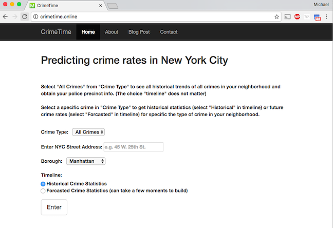
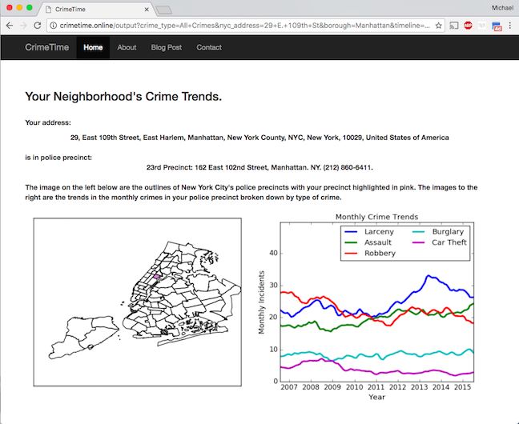
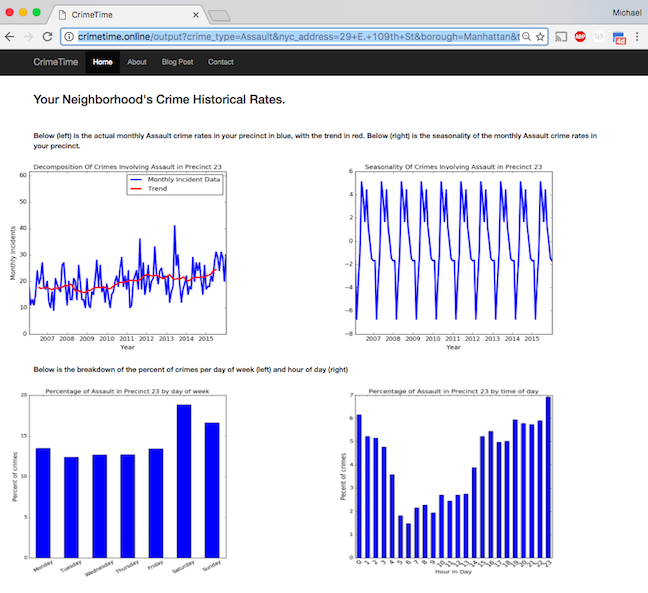

# CrimeTime: Predicting crime rates in NYC

## Introduction 

This web application was part of a 3 week project at <a href="http://insightdatascience.com/">Insight Data Science</a>.  I originally started this project because I was interested in developing a data driven approach to reducing crime in the NYC area.  Working on this project I quickly noticed that different neighborhoods are affected by different types of crime and these crimes peak at different times of the year (you can see this <a href="http://michael-harmon.com/blog/crimetime.html">blog post</a> to read more).  I thought if I could make a web application that forecasts monthly crime rates on a local level it might help police redistribute their resources more effectively and thus reduce the crime in NYC.  The applicaiton could also be of interest to individuals or business who are concerned about crime rates in their neighborhood.  

The application prompts to enter an address from the input page seen below:
	

And they get back a report on the historical trends of crimes in their neighborhood:

	

Users can select specific crimes in their neighborhood and get the historical trend, seasonality, as well as which days and times most of these crimes happen.  The results for assault are shown below:

	

Users can also choose to forecast specific crime rates into the future.

## How It works

This code was written using <a href="https://www.python.org/"> Python</a> and <a href="http://flask.pocoo.org/"> Flask</a>
and deployed to <a href="https://aws.amazon.com/"> Amazon web services.</a> Users are prompted to enter an address and then I use the <a href="https://pypi.python.org/pypi/geopy">geopy</a> library to get
the latitude and longitude of the address.  Once that latitude and longitude are known I 
use the <a href="https://pypi.python.org/pypi/Shapely">shapely</a> library to find out which police 
precinct the address is in and obtain the data on that police precinct.

The info for police precincts was obtained by scraping the NYPD's 
<a href="http://www.nyc.gov/html/nypd/html/home/precincts.shtml"> website </a> using the
<a href="https://pypi.python.org/pypi/beautifulsoup4"> beautifulsoup</a> library and 
also this specific
 <a href="https://nycopendata.socrata.com/Public-Safety/Police-Precincts/78dh-3ptz/data">database</a>. The historical crime data was obtained from the <a href="https://nycopendata.socrata.com/">NYC Open Data Website</a> 
and cleaning was completed using <a href="http://pandas.pydata.org/">Pandas</a> and
<a href="http://geopandas.org/">GeoPandas</a>. The data was then stored in a 
<a href="https://sqlite.org/">SQLite</a> database. Forecasted crime rates were predicted using a 
<a href="http://www.statsmodels.org/dev/generated/statsmodels.tsa.statespace.sarimax.SARIMAX.html">seasonal ARIMA</a>
model through the Python library <a href="http://statsmodels.sourceforge.net/"> StatsModels</a>. 
I used a grid search to obtain the appropriate model paramaters with the selection criteria that the choice of parameters must minimize the validation error.

## Dependencies

1. Python 2.7
2. SQLite
3. StatsModels (0.8.0rc1)
4. Pandas (0.19.1)
5. GeoPandas (0.2.1)
6. Geopy (1.11.0)
7. Shapely (1.5.17)
8. Flask (0.11.1)
9. Basemap (1.0.7)
10. Matplotlib (1.5.3)
11. Numpy (1.11.2)
12. Beautifulsoup4 (4.5.3)
13. Sphinx (only to build documentation)
14. pytest (only for testing)

## Running it on your own computer

To run this web application on your computer make sure you have obtained or built the SQLite
database and have all the dependencies installed on you computer.  You can install all the 
dependencies using <a href="https://pip.pypa.io/en/stable/">pip</a> (except for python, Sphinx, Basemap and Statsmodels) by typing the following command from the 
<code>CrimeTime/</code> directory:

<code> pip install -r requirements.txt</code>

To install Basemap (1.0.7) and StatsModels (0.8.0rc1) use the <a href="https://www.continuum.io/anaconda-overview">Anaconda</a> distribution.

Then run the command in the <code>CrimeTime/</code> directory:

	python run.py	

You should see something like:

	Running on http://0.0.0.0:5000/ (Press CTRL+C to quit)	

Enter the address http://0.0.0.0:5000/ into your web browser to use the web application.

## Building the database

To build the database on your local machine first download the file "NYPD_7_Major_Felony_Incident_Map.csv" from the NYC Open Data website and
place it in the <code>CrimeTime/data/</code> directory. Then type
the folowing command into your terminal from the <code>CrimeTime/</code> directory,

	python ./backend/PreProcessor.py	

**NOTE: If NYC Open Data no longer has the file on their website, please email me and I will provide you with the database.**

## Testing

To test the code to make sure it works run the following command in your terminal shell from the <code>/CrimeTime/</code>directory:

	py.test tests	

You will then see a report on the testing results.

## Documentation
To build the documentation for this code type the following command in terminal from <code>/CrimeTime/</code> directory:

	sphinx-apidoc -F -o doc/ backend/
Then cd into the <code>doc/</code> directory and type,

	make html

The html documentation will be in the directory <code>_build/html/</code>.  Open the file <code>index.html</code> in that directory.

